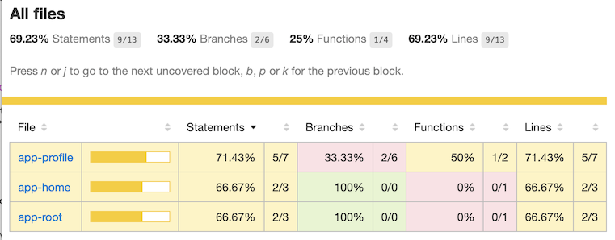
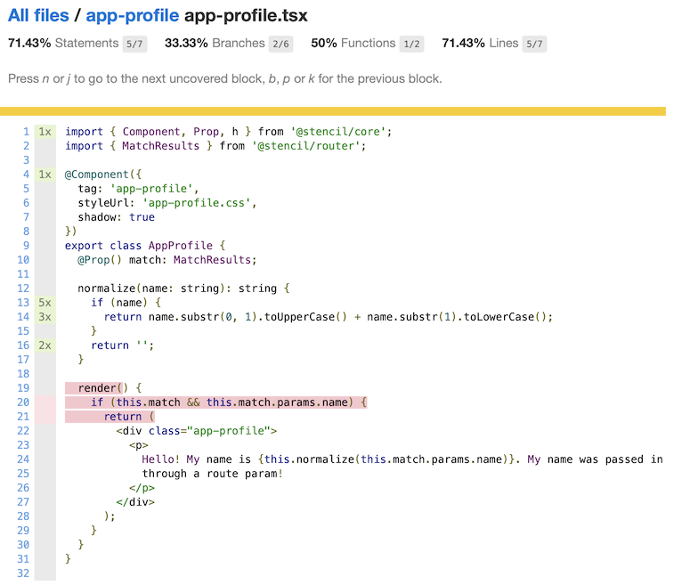

# Testing Web Components with Stencil

This is a starter app that shows the limitations of code coverage output when
using puppeteer based tests.

## Install

Get the code and dependencies:

```
git clone [this repo]
cd [directory created]
npm install
```

## Issue 1: Code Coverage Reporting

There are two sets of tests running here, referred to as "unit" tests
designated by `*.spec.*` files and and "e2e" (end to end) tests designated by
`*.e2e.*` files.


To get coverage output pass the `--coverage` flag to the test runner:

```
npx stencil test --spec --e2e --coverage
```

Now you can view some html reporting that was generated locally:

```
open coverage/lcov-report/index.html
```

You will notice the coverage is around 69%.  If you drill further into the
reporting by clicking on the module links you will notice the reporter has
marked the `render` function as never called. This report is false because the
e2e test renders the components, the reporting just fails to account for it.




